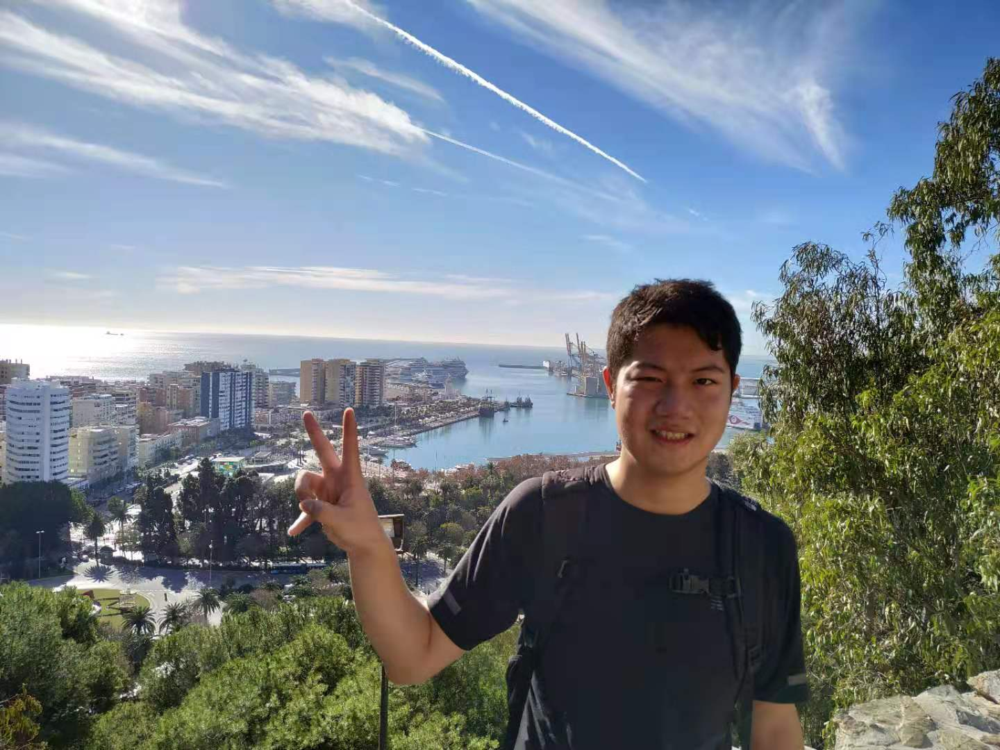

# Known Configurations: An Effective Data-Driven Four-Action-Strategy Robotic Manipulation Approach for Deformable Object Flattening
## Abstract
Robotic deformable-object manipulation is a challenge in the robotic industry because deformable objects have complicated and various object states. Predicting those object states and updating manipulation routes are time-consuming and computationally costly. In this paper, we propose an effective robotic deformable-object manipulation approach by recognising the ‘known configurations’ of the garments with a 'known configuration network' (KCNet) and choosing pre-designed manipulation routes based on the recognised ‘known configurations’. Our manipulation routes feature a four-action strategy: finding two critical grasping points, stretching the garments, and lifting down the garments. We demonstrate that our approach is 65% faster than state-of-art(SOA) and enables manipulating garments with various shapes.

## Video Demonstration
<iframe width="560" height="315" src="https://www.youtube.com/embed/BJl50A1xN08" title="YouTube video player" frameborder="0" allow="accelerometer; autoplay; clipboard-write; encrypted-media; gyroscope; picture-in-picture" allowfullscreen></iframe>

--------------------------------------------------------------------------------------------
## Examples

-----------------------------------------------------------------------------------------------
## Downloads
\
 [<a taget="_blank" title="Paper" href="https://www.overleaf.com/read/zhjhhfgvvhnw">Paper</a>][<a taget="_blank" title="Code" href="https://github.com/LiDuanAtGlasgow/known_configurations">Code</a>][<a taget="_blank" title="Database" href="https://gla-my.sharepoint.com/:u:/g/personal/2168518d_student_gla_ac_uk/EYzzjcNlfS1Gsp772qxqqHgBhSWW59DyeQeN5tJ252Dpsg?e=frlymY">Database</a>]

 

## The Author
\
My name is Li Duan (Ken), and I am a final year PhD student at the University of Glasgow, Scotland. My interests include robot continuous perception and deformable object manipulation. Recently, I have been working on investigating geometric and physical properties of fabrics and garments, through which I am engineering methods to improve robot deformable object manipulations.\
I am willing to hear from our community, so your suggestions are welcomed. Please reach me at:\
Twitter: [@liduanglasgow](https://twitter.com/liduanglasgow)\
Email: <em>l.duan.1 at research.gla.ac.uk</em>
